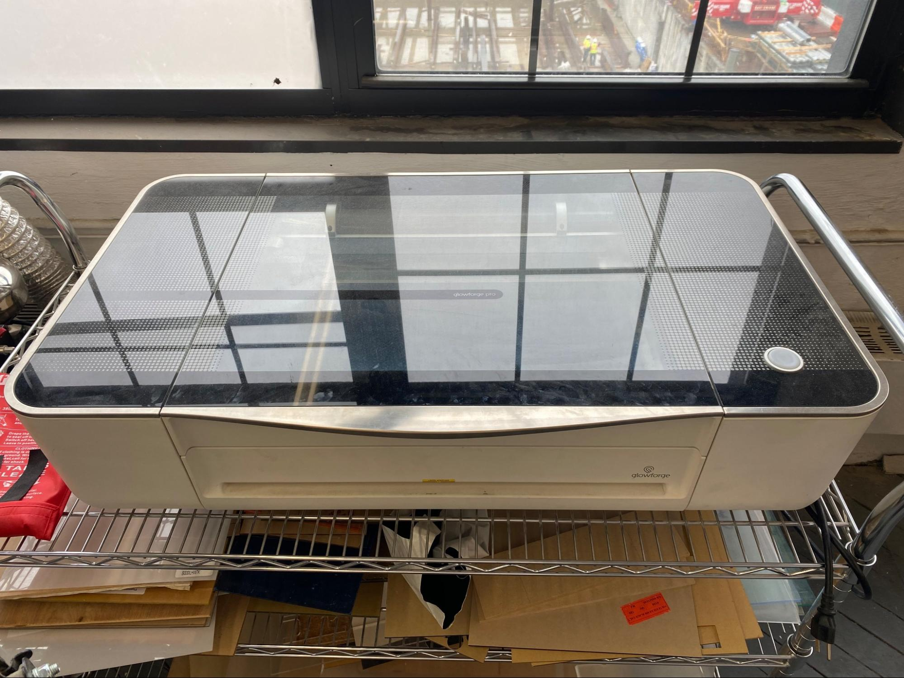
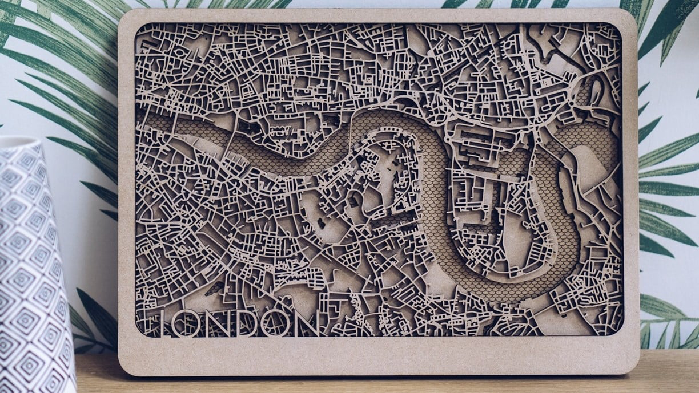

# Cutting/Engraving Area

## Laser Cutter - Glowforge Pro

### ⚠️ Safety:

- Never cut PVC / Polycarbonate / Lexan. It makes chlorine gas.
- You MUST stay with the laser while it is cutting. Do not leave it unattended.
- This tool can start fires inside of it.

### Note:

- Any material under the laser is available for use in projects. Keep plastic at your desk you’d like to keep separate.

### Cut Examples:

