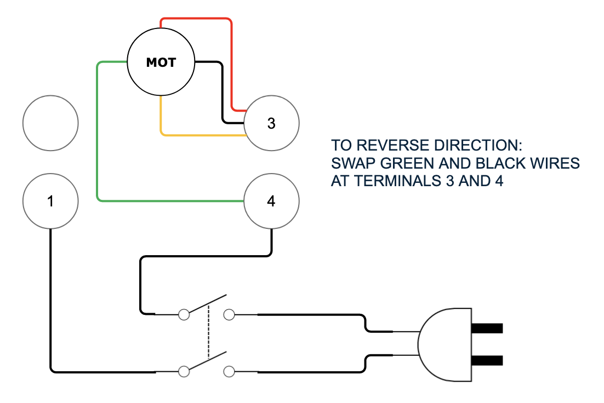

# The Wood Shop

---

## Power Tool Workbench

In the center of the woodshop is a customized Ron Paulk Workbench, upheld by Flexpipe. The workbench is ideal for its flexibility: its 20 mm center-to-center holes make it a clamping station, the 6” side openings allow for storing tools, and its wooden frame allows for easy modification. It is home to a table saw, router table, and a variety of tools to assist with these machinery, as well as for fixturing onto the table.

### Tools

In the pockets of the workbench there are two beds of tools. Bay #1 contains tools such as push sticks and feather boards to be used with the table saw and router table. Bay #2 has clamps and bench dogs to fix wood pieces onto the workbench itself. Beneath the workbench is a third bay home to an INCRA miter gauge and the Woodpeckers Super Fence for the router table. The default state of these tools is in its opening in the foam.

#### Bay #1

1. Red [Woodpeckers Variable Pressure Featherboards](https://www.youtube.com/watch?v=E0ciKn1a920) latch onto the Router Table to maintain a consistent pressure onto a workpiece keeping it flat on the table, reducing the chances of a dangerous kickback. The pressure of the featherboard can be adjusted without having to move it once installed. The bottom left corner of the bay contains push sticks to feed wood through the table saw, preventing kickback and ensuring a smooth finish.
2. The Powertec magnetic push stick can be used for the table saw and the router table. The L shaped stick is ideal as it can hold down and guide an entire piece of wood without requiring a change of grip or position.
3. The white push blocks are used for gripping and maneuvering a piece more efficiently.
4. The red push stick is ideal for controlling narrow pieces, the extra length keeps your fingers safe!
5. The [MicroJig](https://m.media-amazon.com/images/I/B1u9XfaDeoS.pdf) is used for cutting small pieces, thin cuts, dowel cuts, and tricky cuts. It can be used for free hand routing on the routing table.
6. The area holds the tools to be utilized with the router. The wrenches in the upper left are 24 mm and 16 mm, respectively, the collet wrench and the shaft wrench. To the right are two insert rings for the router table, 2” and 2 ½”. In the table has a 1 ⅜” insert ring in place already. There is a collet chuck with a collet of ½” as well. The table has the ¼” collet chuck in place already. The U shaped tool with a handle is an insert wrench. To its right is a height adjustment handle for the table.

#### Bay #2

1. The [UJK Dog Rail Clips](https://www.youtube.com/watch?v=QxIkut7-nl4&feature=youtu.be) attach onto bench dogs and slide onto the Festool guide rail to form a secure attachment between the workpiece and the table.
2. The [Kreg Bench Clamp with Bench Clamp Base](https://www.kregtool.com/on/demandware.static/-/Library-Sites-RefArchSharedLibrary/default/dw14617544/manuals/KBC3-BAS_NA.pdf) screws into a dog hole and clamps the top face of the wood onto the workbench.
3. [Festool Clamping Elements](https://www.youtube.com/watch?v=EUN-GCjdwXI) works similarly, although both ends lock into the table and the clamping force is parallel to the table.
4. To the right of these clamps are a set of allen keys (metric).
5. The tapered bench dogs of different lengths are to be used with the UJK Dog Rail Clips. The bench dogs allow you to anchor a workpiece fast while working or to anchor a workpiece that may not fit beneath the other clamps.
6. Clamps that are similar to the Straight Edge Festool Clamps but are tightened by screwing the handles.
7. The Straight Edge Festool Clamps allow for quick clamping, securing onto the Festool Guide Rail or into the dog holes or the workbench.

#### Bay #3

1. The Woodpeckers Super Fence is a router fence which mounts onto the rails in the Workbench, for guiding or securing a workpiece. It has a dust collection port which can connect directly to the main dust tube. The Woodpeckers Variable Pressure Featherboards in Bay #1 can be attached directly to the fence or to the t-rail extrusion which is on the table itself. When using the fence, offset one of the sides of the fence for a smooth backing to push the piece against (as some material is shaved off).
2. [Miter 1000SE by Incra](https://www.youtube.com/watch?v=-BZWyduxVZQ) is used for cutting wood at a set angle. It can slide into a slot in the table.

---

## Table Saw - [SawStop Jobsite Saw Pro](https://www.sawstop.com/wp-content/uploads/2021/10/M_JSS_Pro_5522_5th_print_small.pdf)

This table saw can detect a finger and stop the blade in less than 5 milliseconds. As of 2022-12-14, this is in the process of being installed. Here is a [video](https://www.youtube.com/watch?v=E4TGqkLdJCI) on how to set up and use the machine. The default state of the table saw is with the following items installed: the dust collector, blade guard, spreader, and anti-kick back pawls.

### ⚠️ Safety

- Keep guards in place. They must be properly mounted for use.
- Never stand directly in line with the saw blade.
- Never leave the table saw running unattended.
- Unplug the machine whenever making any adjustments to it.
- Do not use the saw unless the table is locked in one of the two positions: fully closed (not extended) or fully open (fully extended).
- Attach/assemble dust collector before using. Details below.

### Assembly Information

#### Accessory Drawer

In the accessory drawer, revealed when the table is extended, is a riving knife that can replace the default system. The primary reason to use the riving knife is for non-through cuts where the blade guard and splitter cannot be used when the wood piece is too thick. Page 31-33 of the manual provides details for this removal/installation process.

#### Set Desired Elevation and Tilt

Rotate elevation hand wheel clockwise (1A) to raise blade, or counter-clockwise (1B) to lower blade. A single rotation adjusts blade elevation from fully lowered to fully raised, and vice versa:

 

Blade tilt angle is indicated by the position of the red pointer over the tilt scale. Change tilt angle by squeezing the backplate against the hand wheel and sliding the hand wheel to the side. Release backplate to lock blade in place. This adjusts tilt angle in single degree increments:

 

Adjust tilt angle in fractional degree increments by rotating tilt adjustment knob:

 

#### Fence

- Use the fence to guide material during rip cuts.
- To move the fence, push down on the red lever on the fence to unlock it.
- Use the red indicator line on the right side of the fence at the bottom to determine the cutting width.
- Push down on the opposite side of the lever to lock the fence again.

#### Table

- Extend the table for cuts larger than 12”.
- Flip out the handle to unlock the table. Slide the table to the right to extend it. Flip handle towards the saw to lock the table in place. The rails for the table must be fully extended to lock the handle.
- Use the upper black scale when the table is retracted. Use the lower red scale when the table is extended.

#### Low Fence

- When using thin or narrow strips of material, use the low fence.
- The low fence is one inch wide; subtract one inch from the values on the ruler when using the low fence.
- Store the low fence on the right side of the rip fence. Low fence can be used on either side of the rip fence. To use the low fence on the left side of the rip fence, pull the lever forward and slide the low fence slightly back to unhook rear.
- Flip the low fence over and hook the rear end on the left side of the rip fence. Push the lever back to lock the low fence in place.
- Do not allow the low fence to make contact with the blade.

#### Blade Change

- Unplug the saw
- remove the table insert and the riving knife
- Loosen the arbor nut and remove the blade
- Blades are stored in the cubbies above the jointer. 
- If a blade is dull, write 'DULL' on it and post to the #General channel on Slack. 

#### Dust Collection

Attach the 4" flex drop to the saw port in the workbench:

Open the orange port at the side of the workbench:

Attach the black vacuum hose to the clear blade guard opening:

### Usage Information

- Switch Power on and wait around 10 seconds for the red status light to turn off. This is a good time to consider your ~~life choices~~ setup and your plans for supporting the workpiece through the cut.
- Pull the red paddle to begin spinning the blade.
- Push paddle in to stop.

---

## Router Table - [Bosch 1617EVS](https://www.boschtools.com/us/en/ocsmedia/2610051825_1617_0518.pdf)

The Router table that the router is attached to [JessEm Tool Company Mast-R-LiftTM II](https://cdn.shopify.com/s/files/1/2315/8051/files/02120_-_MAST-R-LIFT_II_-_ENGLISH_AND_FRENCH.pdf?385549945005827004) in the workbench. There is another Festool handheld router in storage. The router table is helpful as it provides a secure and flat workspace to cut joinery, rabbets, and slots very easily. It is a safer option when working with larger pieces. Here is a [video](https://www.youtube.com/watch?v=E4TGqkLdJCI) on how to use the router in a fixed plunge, plunge base, and router table. The default state of the router table is with the collet chuck below the surface of the workbench and with the router bits removed. Consider using the woodpeckers super fence in Bay #3 or the featherboards in Bay #1 with the workbench table rails for guiding the workpiece.

### ⚠️ Safety

- Use push sticks and feather boards to hold down the workpiece and keep your hands away from the drill piece.
- The bit shank and chuck should be clean and free of dust/wood/grease before assembly.
- Attach/assemble dust collector before using. Details below.

### Tools

In Bay #1 of the tools, section F contains the tools necessary for using the router.

- The insert rings available are:
  - 1 ⅜”
  - 2”
  - 2 ½”  
    \*The insert wrench is used to insert and remove these rings.
- The collets sizes available are:
  - ¼”
  - ½”  
    \*These grip the router bits. Check to see that the collet is properly seated in the collet chuck nut. Replace worn or damaged collet chucks immediately.

### Assembly Information

- Use the height adjustment handle to bring the table all the way up prior to assembling the router bit.
- Use the collet wrench (24 mm) to loosen the collet chuck assembly counter-clockwise.
  - Verify that the bit’s shank is of the proper diameter for the collet to be used, otherwise replace with the ½” collet chuck. Insert the shank of the router bit into the collet chuck as far as it will go then back it out until the cutters are about ⅛” to ¼” away from the collet nut face. It should be inserted at least ⅝”.
- With the router bit inserted and the shaft wrench holding the armature shaft, use the collet wrench to tighten the collet chuck in a clockwise direction.
- Use the height adjustment handle to bring down the table to the desired height using the given metric measurements on the table.

### Dust Collection

Attach the 4" flex drop to the router port in the workbench:

### Removal Information

- To remove the router bit:
  - Use the shaft and collet chuck wrenches and turn the collet chuck assembly in a counter-clockwise direction.
  - Once the collet chuck is loosened, continue to turn (a second time) until it pulls the collet free from its taper and the router bit can be removed.
  - The start pin can be put in place to guide the wood past the router to keep the workpiece in place.

---

## Ulmia Woodworking Bench

This bench is used for hand tool woodworking.

### ⚠️ Safety

- The bench itself is less dangerous than the tools you use on it. Use the appropriate gloves, eye protection, and foot protection as required for operations you will be performing.

### Assembly & Usage Information

- Vises
  - The face vise is on the left of the bench. Use this for holding material off the left side of the bench. The vise holds the right end of the material, your left hand holds the left end of the material, and saw cuts happen in between.
  - The tail vise is on the right side of the bench. Use this vise with the bench dogs to hold long flat materials on top of the bench.
- Bench dogs
  - There are three bench dogs that fit in the rectangular holes along the length of the top of the bench. Two of the bench dogs fit the main bench, one of the dogs fits in the holes of the tail vice.
  - The bench dogs are used to stop material from sliding on top of the bench or to hold objects by pinching the object between two bench dogs – one in the main bench and one in the tail vice.
  - Push the bench dog up from below the bench just high enough to be just less than the thickness of the object. Bench dogs are pressure-fit to stay at the adjusted height. If they are too hard to move, please use wax to lubricate the bench dogs.
- Hold fast hole
  - The blue metal reinforced hole in the middle of the bench is a hold fast hole. Use the hold fast hole to use a hold fast as a clamp to hold material to the top of the bench.
- Drawers
  - There are two drawers: one counterbalanced large drawer on the front and a small sliding drawer behind the tail vise.

---

## Bandsaw - Delta 14"

- The saw is equipped with a mobile base. Use the foot paddles to lower the casters to move it, and make sure it is immobilized before use.
- This saw is configured for cutting soft materials such as wood and plastic.
- The saw takes a 93 ½” blade, and is equipped with one of three blades:
  - [3/4" x 2/3VPC](https://www.pswood.com/3-4-x-2-3vpc-series-timber-wolf-band-saw-blades/) rip blade for straight cuts in thick materials (>3”)
  - [1/2" x 3/4VPC](https://www.pswood.com/1-2-x-3-4vpc-series-timber-wolf-band-saw-blades/) general purpose blade for material down to 1” thick
  - [1/4" x 8RK](https://www.pswood.com/1-4-x-8rk-series-timber-wolf-band-saw-blade/) turning blade for thin materials and for curves down to ⅝” radius

### ⚠️ Safety

- Wear safety glasses and hearing protection.
- Do not wear jewelry or long sleeves. Tie up long hair.
- Make sure that the cut is supported by the table. If the part being cut is cantilevered off in space, it can tilt and catch the blade
- Use the table insert whenever possible.

### Assembly Information

#### Changing the blade
  1.  Unplug the saw.
  2.  Remove upper and lower wheel guards, and dust collection.
  3.  Remove the table peg and insert.
  4.  De-tension the upper wheel using the handwheel on the frame.
  5.  Remove the blade. Blades are stored in the cubbies above the jointer. Use caution in rolling up or un-furling a blade, as they can move quickly and are sharp! 
  6.  If a blade is broken or dull, post to #General in Slack.
  7.  Back off the thrust bearings at top and bottom blade guides
  8.  Install the new blade on the wheels, and tension to the mark corresponding to the width of the blade.
  9.  Check the blade guide blocks; make sure they are not in contact with the blade. If they make contact, back them out until they are well clear. If they are worn, post to #general.
  10. Spin the upper wheel by hand, paying attention to the tracking. Use the tracking adjustment (near the top wheel tension) to position the blade in the middle of the wheel.
  11. Reinstall the upper and lower wheel guards (skip the other parts for now) and plug in the saw.
  12. With the saw running, de-tension the upper wheel until the blade just starts to flutter, then tension until it stops.
  13. Advance the thrust bearings until they contact the blade and spin, dial them back until they do not make contact. Turn off the saw.
  14. If the blade guide blocks need adjustment, unplug the saw again. Set the blocks so that a business card (a cheap one, not one of those fancy thicc bois) can be slipped into the space on each side without moving the blade.
  15. Install the table insert, dust collection, and table peg.

#### Adjusting the fence:
  1.  To be documented

#### Adjusting the table:

  1.  Remove the table insert.
  2.  Loosen the hand screws in front and behind the blade which clamp the table to the trunnions.
  3.  The table can be set between 0 and 45 degrees to the horizontal. There is an adjustable stop at 0.
  4.  Move the table to the desired angle, and tighten the hand screws.

### Dust Collection

- Attach a 4" vacuum hose to the gate at the front of the saw.

### Usage Information

- Use the proper blade for the operation.
- When sawing aluminum, make sure there are at least two teeth in the material; i.e. for ½” aluminum plate, use a blade with at least 4 TPI. More teeth, more better the cut.
- Don’t trust the saw to cut parallel to the fence unless you set it up to do so (following the instructions above usually does the trick). If you’re making a quick cut and don’t want to go through the setup, just cut to a line rather than using the fence.

---

## Jointer - [Wadkin Bursgreen 9-1/4"](https://www.wadkin.com/archive%20pdfs/Wadkin%20BFT%209%20inch%20Planer%20Manual%20Parts%20List.pdf)

A jointer provides two operations:

- Face jointing produces a single planar surface without respect to any other surface. It is generally the first step in squaring stock.
- Edge jointing produces an edge which is planar and perpendicular to an adjacent face. It is generally the second step in squaring stock. It is also important for making edge-to-edge glue joints, which is where the machine gets its name.

Once a workpiece has two planar, perpendicular reference faces, it is ready for other operations:

- A tablesaw can make the other edge parallel to the reference edge
- A planer can make the other face parallel to the reference face.
- Or, as in many handwork traditions, all measurements can be done with respect to the reference face and edge, and the other faces allowed to run wild and just be themselves.

### ⚠️ Safety

- Wear safety glasses and hearing protection
- Do not wear jewelry, long sleeves. Tie up long hair.
- Do not remove the ‘porkchop’ guard while the jointer is plugged in. There are few, if any, operations which cannot be performed with the guard in place.
- Use push blocks (paddles) whenever possible.
- Do not joint material less than 12” long.
- Do not face joint material less than ⅜” thick.
- Do not edge joint material less than ¼” thick or less than 1” wide.

### Assembly Information

- Tables:
  - Both the infeed and outfeed tables are height adjustable. There is a cam lever on the front of the machine which locks the table in position. There is a knob under each table which adjusts the height of the table.
- Fence:
  - The fence is adjustable left and right to make use of different parts of the knives, and to allow rabbetting (this jointer is not equipped with a rabbetting table).
  - The fence is also adjustable for angle, with a stop at 90 and 45 degrees. There is a protractor to indicate the angle.
  - There is a small auxiliary fence which must be loosened when adjusting the height of the outfeed table. This is useful when face jointing thin stock, and can be safely moved out of contact with the table when not needed.
- Cutterhead:
  - This jointer is equipped with straight knives. These are a little harder to install than indexable cutters, usually involving a dial indicator, a straightedge, and some light cursing. Don’t remove or adjust them unless you are prepared to spend a few hours putting them back.

### Dust Collection

- Attach a 4" vacuum hose to the gate at the back of the jointer.

### Usage Information

- Check that dust collection is connected, gated properly, and turned on before using the jointer.
- Check stock for nails or other foreign materials, and remove them before jointing.
- Allow the cutterhead to come up to full speed before the stock is run through.
- Face Jointing:
  - The fence is not relevant to this operation. Set it as far back as required and don’t worry about the angle.
  - Set the infeed table to the desired depth of cut. Take no more than 1/32” off of knotty wood. 1/16” is recommended for most work in clear lumber. Deeper cuts, especially with wide boards, can bog down the machine, or can require excessive force to feed the stock.
  - Use push blocks in both hands to push the stock down against the table and feed through the cutter.
  - Do not push with your thumb or fingers on the end of the board.
  - Thin stock can chatter when it first encounters the cutterhead, before it is supported by the outfeed table. Your left hand push block should be just ahead of the cutter at the edge of the infeed table and pushing down hard, to best support the work.
- Edge Jointing:
  - Set the fence to the desired angle (usually 90 degrees) and verify with a known square.
  - Set the infeed table to the desired depth of cut. Take no more than 1/32” off of knotty wood. Because edge jointing presents less wood to the cutterhead, it is possible to make a deeper cut without bogging down the machine; however, 1/16” depth of cut is recommended for most work.
  - Since you are making an edge square to a face, orient the workpiece so that the reference face is against the fence.
  - Use a push block in your left hand to press the stock against the fence. It’s useful to do a dry run where you can find out if the bottom or the top tends to come off the fence, and adjust your technique as necessary.
  - Use your right hand to drive the stock through the jointer. Keep hands 6” above the table - when jointing smaller stock, it will be necessary to use a push block or push stick. Consider your strategy before turning on the machine.

### Wiring Diagram

---

## Planer - [Dewalt DW735 13” Planer](https://www.dewalt.com/product/dw735/13-three-knife-two-speed-thickness-planer)

A planer creates a parallel surface by dragging the reference surface of the wood across the flat steel base plate and using rotating blades to cut the top surface.  
The best time to use a planer is after you have used the jointer to flatten one surface and the object is twice as wide as it is tall. Particularly for objects of the inappropriate ratio, consider using the table saw to create a parallel cut.

### ⚠️ Safety

- Wear safety glasses and hearing protection
- Do not wear jewelry, long sleeves. Tie up long hair.
- Do not place hands or anything not being planed inside the planer while it is plugged in.
- Do not reach inside to clear wood debris while the planer is plugged in.
- Do not plane material less than 6” long.
- Do not plane material less than 1/8” thick.
- Do not plane material that is less than twice as wide as it is tall.
- Do not plane more than 1/8” material per pass from softwoods such as pine.
- Do not plane more than 1/16” material per pass from hardwoods such as oak.

### Assembly Information

- Tables:
  - The infeed and outfeed tables are delicate and can easily be bent out of shape. They fold up to keep them out of the way.
  - Be sure to use roller stands to support long and heavy objects.
- Cutterhead:
  - This planer is equipped with three straight knives. These can be accessed by removing the top cover and internal dust cover. To remove the covers, use the integrated hex wrench to unscrew the four screws in the top cover. Unscrew the three long red thumb screws that secure the dust cover. There is an integrated screw tray in the top of the planar to store the screws. Remove the dust cover by sliding it to the side and pulling it up.
  - The blades are secured by eight screws and can be loosened with the same integrated hex wrench. Use the magnets on the handle of the hex wrench to handle the blades. Please note that the blades are double sided, so once one side wears out, you can flip them around to get a fresh blade. Please be sure to mark the blade edge as used with a sharpie if you are flipping around the blade.
  - If you have a chip in one blade causing streaks in your cuts, you may need to only shift the blades left or right in the slotted holes instead of replacing the blades.
- Cutting gauge:
  - The red needle gauge on the front of the planer indicates how much material will be removed if you place the wood just at the front lip of the planer. See safety for maximum material cuts. Multiple shallow cuts is better for the equipment (and your wood) than a single deep cut.
- Feed rate switch:
  - There are two speeds for the feed rate: slow and fast. Slower cuts will result in a better finish. Only switch speeds when the planer is running. Do not switch it when the power is off.
- Thickness adjustment:
  - The minimum thickness stop gauge is a wheel on the left that indicates the minimum thickness. This ranges from ⅛” to 1 1/4" thick. Set to the minimum 1/8" by default.
  - The thickness crank handle on the left moves the planer up and down. Each full turn of the crank moves the planer approximately 1/4".

### Dust Collection

- Attach a 4" vacuum hose to the port at the back of the planer. The planer has a fan which creates positive pressure, so be sure that the hose is firmly attached, otherwise the hose will be ejected if the planer is on while the dust collector is off.

### Usage Information

- Check that dust collection is connected, gated properly, and turned on before using the planer.
- Check stock for nails or other foreign materials, and remove them before planing.
- Before turning on the planer, check the minimum thickness stop gauge and adjust the height of the cut by placing your wood just inside the lip of the planer in the middle of the width and lower the cut height until the cutting gauge just barely moves as it touches the material.
- Turn on the planer and set the feed speed to slow or fast as you require.
- Push the material into the planer slowly and carefully until you feel the power feed grab the object and start pulling it through. If you do not feel the power feed take the material, remove the piece, lower the height by 1/4 turn of the handle, and try again. Repeat until the power feed takes the material and you get a light cut.
- Reminder: do not put your hands into the planer for any reason while it is plugged in.
- After your material has been planed, lower the cutting height by 1/4 to 1/2 of a turn of the handle at each pass following the cutting depths indicated by the safety section above.
- In order to wear the cutting knives down evenly, send material through the planer at a different location width wise each time.

---

## [CNC Router](../cnc)

The CNC is complicated, please read the docs linked above.

## ⚠️ Safety

1. The machine moves quickly and expects to encounter resistance - your body will not stop it. Always keep the router's door closed when a job is running.
2. Check for potential crashes before every machine movement.
3. Secure your workpiece; if it isn't secure, it could go flying.
4. Secure the tool in the collet.
5. **Never** leave the machine unattended while it's running code. Do not leave the room without pausing the job.
6. Running a CNC machine is a complex process. This document is not sufficient training for safe machine operation. If you haven’t done this before, have somebody walk you through your first run.

## Wood Finishes, Paint, Glue, Etc

### Storage

- Products marked 'FLAMMABLE' should be stored in the yellow flammables cabinet
- Products marked 'COMBUSTIBLE' may be stored in the red general storage cabinet.
- Wood finishes should not be left in the shop when not in use.

### ⚠️ Safety

- Some finishes, e.g. polyurethane, will generate harmful fumes.
  - Make sure the area is properly ventilated.
  - Make sure no other shop member needs the area before the fumes are gone.
- Be careful with oily rags.
  - Drying oils (linseed oil, tung oil, etc) generate heat when they cure. A crumpled up rag soaked in a drying oil can self combust.
  - Don’t burn the shop down!
  - Let oily rags dry on the designated metal tray, and make sure they’re laid out flat. When they’re 110% dry, toss them in the garbage.
  - If you’re in doubt about how to handle this, ask for help.
